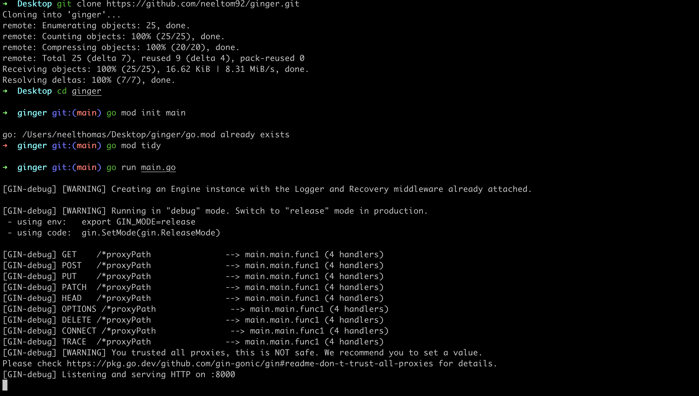
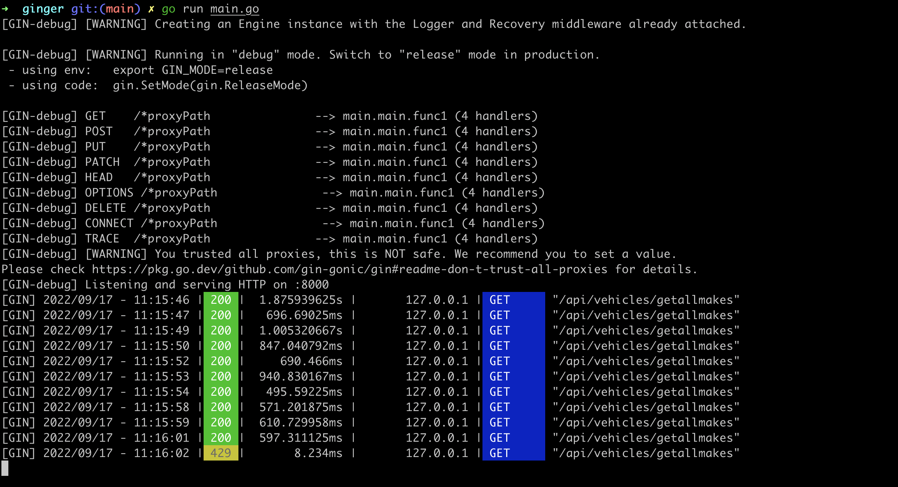
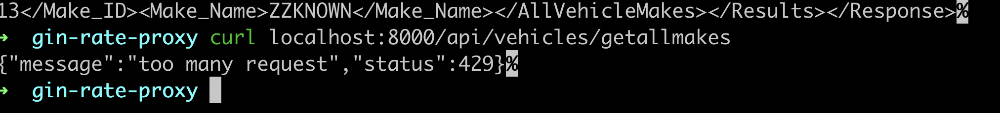

# Ginger

[](https://opensource.org/licenses/MIT)


A simple proxy middleware and global rate limiter using Go and  [ gin ](https://github.com/gin-gonic/gin) for protecting your exposed API's

# Usecase

There will be scenarios where you would need to protect your systems using a rate limiter, althoug many tools are available out there, sharing a simple global rate limiting tool to help protect your rest API from serving too may requests and making the system down.

This is suitable for small scale applications, where you dont need to install additional tools like Kong or Istio Mesh etc for rate limiting and other purposes and avoid the over head of managing and mainting such systems.

## Installation

1. Create a Redis host, either in AWS or docker in standalone servers etc, this is for implementing the [ Sliding window based Rate Limiter ](https://www.codementor.io/@arpitbhayani/system-design-sliding-window-based-rate-limiter-157x7sburi)

2. Ensure to change the below variables in main.go as per your requirements.

| variable  | description |
| ------------- | ------------- |
|  host         | the API endpoint to which you want to Proxy pass your requests to  |
| requestCount  | number of request that is allowed  |
| secondsTime   | time within which the requests will be throttled  |
| redisHost     | redis host, replace "127.0.0.1" with the actual Redis host needed for the throttling    |
| requestCount  | number of request that is allowed  |
| port          | the port you want the application listen to  |


- Change the "requestCount" and "secondsTime" accordingly, here, I throttle all requests if it cross more than "10 requests within 60 seconds"

2. follow the below steps after the variables has been changed as per your needs.

```bash
cd ginger
go mod init main
go mod tidy
go run main.go
```

## Demo

1. Installation



2. Global rate limting demo

As you can I'm calling this API

```bash
curl localhost:8000/api/vehicles/getallmakes of  the endpoint "https://vpic.nhtsa.dot.gov/"
```
after 10 calls within 60 seconds I started getting 429, as it exceeded the global rate limit I set






#Contributing
- contact on [LinkedIn](https://www.linkedin.com/in/neel-thomas-646a27131/)

